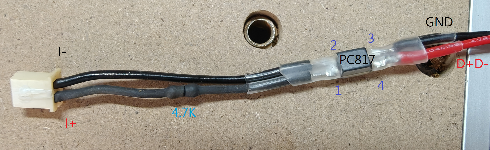
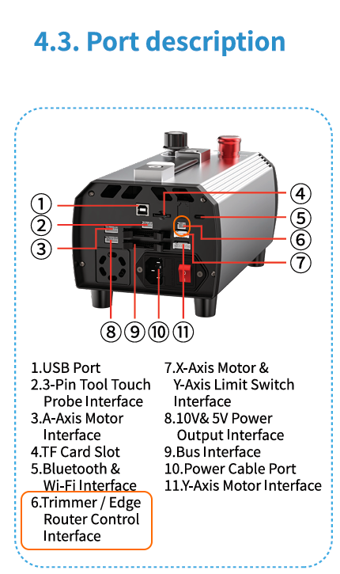

# TTC M1 Vacuum Cleaner Automatic Start/Stop Modification for TTC450 Ultra CNC

This project provides a hardware modification solution to fix the unreliable factory automatic start/stop feature of the TTC M1 vacuum cleaner when paired with the TTC450 Ultra CNC. This mod ensures 100% reliable, spindle-synchronized vacuum control.

---

## 🛑 Stock Design Flaws & Problem Description

The TTC M1 vacuum cleaner comes with an automatic start/stop feature out of the box, but it is notoriously difficult to trigger properly and often fails to shut down automatically.

The stock mechanism relies on an **internal microphone inside the dust shoe to detect spindle activation via noise levels**. This approach introduces two major flaws:
1. **Triggering Issues**: The spindle noise itself is not exceptionally loud, and since it is separated from the microphone by the dust shoe, the acoustic signal dampens significantly, failing to wake up the vacuum.
2. **Failure to Shut Down**: The M1 vacuum cleaner is substantially louder than the spindle. Once triggered, as long as the vacuum and the spindle share the same workspace (without acoustic isolation), the vacuum's own operational noise tricks the system into thinking the spindle is still running, causing the vacuum to run indefinitely.

---

## 💡 Solution & Working Principle

This modification completely bypasses the unreliable acoustic sensor and instead utilizes the **External Spindle Motor Control Interface** on the TTC450 Ultra control box (indicated by Port 6 inside the orange box in Figure 2).

When the spindle is activated, this interface continuously outputs a **24V** signal. We use this 24V signal to drive an optocoupler (PC817). The optocoupler replaces the stock microphone trigger by bridging the USB D+/D- lines to GND when the spindle signal is active. 

This guarantees 100% accurate synchronization—the vacuum starts and stops perfectly in tandem with the spindle.

---

## 🛠️ Bill of Materials (BOM)

All components required for this project are inexpensive and easy to source:

* **XH2.54 2P Plug Housing** x 1
* **XH2.54 Crimp Terminals** x 2
* **4.7K 1/4W Resistor** x 1
* **USB-A to USB-A Short Extension Cable** x 1
* **PC817 Optocoupler** x 1
* **AWG24 Signal Wire** (Appropriate length)

---

## ⚙️ Step-by-Step Instructions

### A. USB Extension Cable Preparation
1. Strip the outer jacket of the USB-A extension cable to expose the 4 internal wires.
2. Cut the **D+** and **D-** wires (typically green and white). Twist and solder the two wires coming from the **USB Male plug end** together, then set them aside.
3. Strip a small section of the insulation on the **GND** (black) wire. **Do not cut the wire.**

### B. Signal Control Cable Assembly
Create a control cable as shown in Figure 1 (the wire length depends on the distance between your CNC control box and the M1 vacuum):

1. Take a suitable length of AWG24 signal wire and the 4.7K resistor, crimp the XH2.54 terminals, and insert them into the XH2.54 2P plug housing. Refer to Figure 1 for pin orientation and polarity.
2. Solder the negative signal wire to **Pin 2** of the PC817 optocoupler.
3. Solder one end of the 4.7K resistor to **Pin 1** of the PC817 (ensure any exposed resistor leads are fully insulated using heat shrink tubing).
4. Solder a piece of AWG24 wire to **Pin 3** of the PC817, and connect its other end to the stripped **USB GND** wire from [Step A].
5. Solder another piece of AWG24 wire to **Pin 4** of the PC817, and connect its other end to the shorted **USB D+ / D-** wires from [Step A].
6. Thoroughly insulate all exposed solder joints (heat shrink tubing or electrical tape is highly recommended). The control cable is now complete.

*(Figure 1: Physical wiring diagram of the control cable and PC817 optocoupler)*

---

## 🚀 Installation & Usage

1. Connect the **Male end** of the modified USB extension cable to the stock control port on the M1 vacuum cleaner.
2. Connect your custom control cable (the part with the PC817) to the **Female end** of the USB extension cable.
3. Finally, plug the **XH2.54 2P plug** on the other end of the control cable into **Port 6 (Trimmer / Edge Router Control Interface)** on the TTC450 Ultra CNC control board.

*(Figure 2: TTC450 control board interface layout. Connect to Port 6 as highlighted)*

Once connected, your TTC M1 vacuum cleaner will perfectly synchronize its automatic start and stop functions with the TTC450 Ultra CNC spindle!
